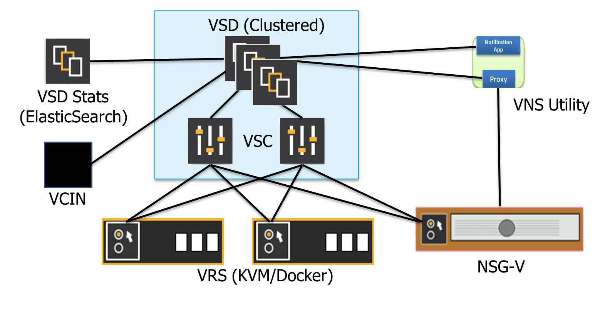

# Nuage Networks MetroAG Automation EnGine (AG)
## Overview
MetroAG is an automation engine used for deploying and upgrading Nuage Networks components.
After specifying the individual details for your target platform, MetroAG (leveraging Ansible playbooks and roles) sets up the environment as specified. Alternatively, the environment could be upgraded, rolled-back, health-checked, etc.

## Supported Nuage VSP Components for Deployment
The following Nuage VSP components are supported for deployment using MetroAG. These are all deployed as VMs on a given _target server_.

Component | KVM (el7) Stand-alone (SA) | KVM (el7) Clustered (HA) | ESXi Stand-alone (SA) | ESXi Clustered (HA)
------- | :---: | :---: | :----: | :---:
VSD (Virtualized Services Directory) | X | X | X | X
VSTAT (Elastic Backend for statistics) | X | X | X | X
VSC (Virtualized Services Controller) | X | X | X | X
VCIN (vCenter Integration Node | X |  | X |
VNSUTIL (Virtualized Network Services-Utility) | X |  | X |

Dataplane components are as follows (installed as package/agent):

Component |  KVM  (el6, el7,ubuntu 14.04/16.04) | ESXi
--------- | :----: | -------
VRS (Virtual Routing & Switching) | X | (upgrade only)
Libnetwork on VRS nodes  | X |
NSG-V (Network Services Gateway-Virtual) |  X |

Auxiliary services are also provided:
* DNS/NTP

## Supported Nuage VSP Components for Upgrade
The following Nuage VSP components are supported for upgrade using MetroAG.

Component | KVM (el7)  SA | KVM (el7)  HA | ESXi SA | ESXi HA
------- | :---: | :---: | :----: | :---:
VSD | X | X | X | X
VSTAT | X | X | X | X
VSC | X | X | X | X
VCIN | X |  | X |

## Use of Ansible Playbooks and Roles
**Ansible** provides a method to easily define one or more actions to be performed on one or more computers. These tasks can target the local system Ansible is running from, as well as other systems that Ansible can reach over the network. The Ansible engine has minimal installation requirements. Python, with a few additional libraries, is all that is needed for the core engine. MetroAG includes a few custom Python modules and scripts. Agent software is not required on the hosts to be managed. Communication with target hosts defaults to SSH. Ansible does not require the use of a persistent state engine. Every Ansible run determines state as it goes, and adjusts as necessary given the action requirements. Running Ansible requires only an inventory of potential targets, state directives, either expressed as an ad hoc action, or a series coded in a YAML file, and the credentials necessary to communicate with the target.

**Playbooks** are the language by which Ansible orchestrates, configures, administers and deploys systems. They are YAML-formatted files that collect one or more plays. Plays are one or more tasks linked to the hosts that they are to be executed on.

**Roles** build on the idea of include files and combine them to form clean, reusable abstractions. Roles are ways of automatically loading certain vars files, tasks, and handlers based on a known file structure.

### MetroAG Playbooks and Roles
MetroAG playbooks and roles fall into the following categories:

Playbook/Role | Description |
------------- | ----------- |
Predeploy | prepares infrastructure with necessary packages and makes the component(s) reachable |
Deploy | installs and configures component(s) |
Postdeploy | performs integration checks, and some basic commissioning tests |
Health | checks health for a running component without assuming it was deployed with MetroAG |
Destroy | removes component(s) from the infrastructure |
Upgrade | upgrades component(s) from one release to another |
Rollback | restores component(s) to their previous version (if an upgrade fails) |

## Getting Started

To get started, you would typically go through these steps:

1. [Setup](Documentation/SETUP.md) your Nuage MetroAG Ansible environment on the host on which MetroAG is to be run.

2. [Customize](Documentation/BUILD.md) variable files so they match your network topology and describe your NuageNetworks deployment specifics.

3. [Deploy](Documentation/DEPLOY.md) the various components (if they have not previously been deployed), perform an [upgrade](Documentation/UPGRADE.md), or run a health check on your system.

4. If things did not work out as expected, [destroy](Documentation/DESTROY.md) or [rollback](Documentation/ROLLBACK.md) your environment.

## Documentation
The [Documentation](Documentation/) directory contains the following guides to assist you in successfully working with MetroAG.

File name | Description
--------- | --------
[RELEASE_NOTES.md](Documentation/RELEASE_NOTES.md) | New features, resolved issues and known limitations and issues
[SETUP.md](Documentation/SETUP.md) | Set up your environment by cloning the repo, installing packages and configuring access.
[BUILD.md](Documentation/BUILD.md) | Populate variable files, unzip Nuage software, and build the environment for deploying
[BUILD_UPGRADE.md](Documentation/BUILD_UPGRADE.md) | Populate variable files, unzip Nuage software, and build the environment for upgrading.
[DEPLOY.md](Documentation/DEPLOY.md) | Deploy all VSP components or choose components individually.
[DESTROY.md](Documentation/DESTROY.md) | Remove existing deployment(s) and start over.
[UPGRADE.md](Documentation/UPGRADE.md) | Upgrade component(s) from one release to the next.
[ROLLBACK.md](Documentation/ROLLBACK.md) | Restore VSP components to their previous version if an upgrade fails.
[CONTRIBUTING.md](Documentation/CONTRIBUTING.md) | Submit your code and become a contributor to Nuage MetroAG.
[OPENSTACK.md](Documentation/OPENSTACK.md) | Deploy VSP components in OpenStack (limited support).

## Questions, Feedback, and Contributing
Ask questions and get support via email.  
  Outside Nokia: [devops@nuagenetworks.net](mailto:deveops@nuagenetworks.net "send email to nuage-metro project")  
  Internal Nokia: [nuage-metro-interest@list.nokia.com](mailto:nuage-metro-interest@list.nokia.com "send email to nuage-metro project")  

Report bugs you find and suggest new features and enhancements via the [GitHub Issues](https://github.com/nuagenetworks/nuage-metro/issues "nuage-metro issues") feature.

You may also [contribute](CONTRIBUTING.MD) to Nuage MetroAG by submitting your own code to the project.

## License
Apache License 2.0
