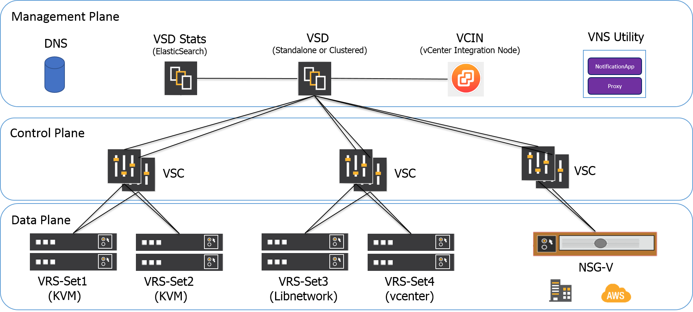

<<<<<<< HEAD
# Nuage Networks MetroAE Automation Engine (AE)
(4 minute read)

Version: 3.0.0

**Note:** The procedures have changed in version 3.0 to improve usability. If you have used previous versions of MetroAE, please see [RELEASE_NOTES.md](Documentation/RELEASE_NOTES.md) for details.

Metro is an automation engine that deploys and upgrades Nuage Networks components.
After you specify the individual details of your target platform, Metro Automation Engine (leveraging Ansible playbooks and roles) sets up the environment as specified. Metro Automation Engine can also upgrade, roll-back, and health-check the environment.

## Supported Components for Deployment
Metro Automation Engine supports deployment of the following components as VMs on the target server. The same target server types are supported as the VSP platform.

Component | KVM (el7) Stand-alone (SA) | KVM (el7) Clustered (HA) | ESXi Stand-alone (SA) | ESXi Clustered (HA)
------- | :---: | :---: | :----: | :---:
VSD (Virtualized Services Directory) | X | X | X | X
VSTAT (Elastic Backend for statistics) | X | X | X | X
VSC (Virtualized Services Controller) | X | X | X | X
VCIN (vCenter Integration Node) | X |  | X |
VNSUTIL (Virtualized Network Services-Utility) | X |  | X |

#### Supported Dataplane components (installed as package/agent):

Component |  KVM  (el6, el7,ubuntu 14.04/16.04) | ESXi
--------- | :----: | -------
VRS (Virtual Routing & Switching) | X | (upgrade only)
Libnetwork on VRS nodes  | X |
NSG-V (Network Services Gateway-Virtual) |  X |

#### Provided Auxiliary Services
* DNS/NTP

## Supported Components for Upgrade
Metro Automation Engine supports upgrade of the following Nuage VSP components.

Component | KVM (el7)  SA | KVM (el7)  HA | ESXi SA | ESXi HA
------- | :---: | :---: | :----: | :---:
VSD | X | X | X | X
VSTAT | X | X | X | X
VSC | X | X | X | X
VCIN | X |  | X |

## Main Steps for Using MetroAE

1. [Setup](Documentation/SETUP.md)  the MetroAE host. Setup prepares the host for running MetroAE, including retrieving the repository, installing prerequisite packages and setting up SSH access.

2. [Customize](Documentation/CUSTOMIZATION.md) your deployment to match your network topology, and describe your Nuage Networks specifics.

3. [Deploy](Documentation/DEPLOY.md) new components, [upgrade](Documentation/UPGRADE.md) existing components, or run a health check on your system.

4. If things did not work out as expected, [destroy](Documentation/DESTROY.md) or [rollback](Documentation/ROLLBACK.md) your environment.

## MetroAE Workflows
MetroAE workflows are the operations that can be performed against a specified deployment.  All supported workflows can be listed via:

    ./metroae --list

Workflows fall into the following categories:

Workflow | Description |
------------- | ----------- |
Predeploy | prepares infrastructure with necessary packages and makes the component(s) reachable |
Deploy | installs and configures component(s) |
Postdeploy | performs integration checks, and some basic commissioning tests |
Health | checks health for a running component without assuming it was deployed with Metro Automation Engine |
Destroy | removes component(s) from the infrastructure |
Upgrade | upgrades component(s) from one release to another |

The following workflows are examples that combine together several of the above operations into simple to use groups:

* install_everything - Deploys all components specified in a deployment.
* destroy_everything - Destroys all components specified in a deployment.
* nuage_health - Checks the health of all components specified in a deployment.

## Ansible
MetroAE is based off of the Python-based Ansible operations tool.  The following sections provide more detail of how Ansible is utilized to perform workflows.

### Nomenclature
**Ansible Host**: The host where MetroAE runs. Ansible and the required packages are installed on this host. The Ansible Host must run el7 Linux host, e.g. Cent)S 7.* or RHEL 7.*

**MetroAE User**: The user who runs MetroAE to deploy and upgrade components.

**Target Server**: The hypervisor on which one or more VSP components are installed as VMs. Each deployment may contain more than one Target Server.

### Use of Ansible Playbooks and Roles
**Ansible** provides a method to easily define one or more actions to be performed on one or more computers. These tasks can target the local system Ansible is running from, as well as other systems that Ansible can reach over the network. The Ansible engine has minimal installation requirements. Python, with a few additional libraries, is all that is needed for the core engine. MetroAE includes a few custom Python modules and scripts. Agent software is not required on the hosts to be managed. Communication with target hosts defaults to SSH. Ansible does not require the use of a persistent state engine. Every Ansible run determines state as it goes, and adjusts as necessary given the action requirements. Running Ansible requires only an inventory of potential targets, state directives, either expressed as an ad hoc action, or a series coded in a YAML file, and the credentials necessary to communicate with the target.

**Playbooks** are the language by which Ansible orchestrates, configures, administers and deploys systems. They are YAML-formatted files that collect one or more plays. Plays are one or more tasks linked to the hosts that they are to be executed on.

**Roles** build on the idea of include files and combine them to form clean, reusable abstractions. Roles are ways of automatically loading certain vars files, tasks, and handlers based on a known file structure.

## Documentation
The [Documentation](Documentation/) directory contains the following guides to assist you in successfully working with Metro Automation Engine.

File name | Description
--------- | --------
[RELEASE_NOTES.md](Documentation/RELEASE_NOTES.md) | New features, resolved issues and known limitations and issues
[GETTING_STARTED.md](Documentation/GETTING_STARTED.md) | Metro Automation Engine Quick Start Guide
[SETUP.md](Documentation/SETUP.md) | Set up your environment by cloning the repo, installing packages and configuring access.
[CUSTOMIZATION.md](Documentation/CUSTOMIZATION.md) | Populate variable files for a deployment and unzip Nuage software.
[DEPLOY.md](Documentation/DEPLOY.md) | Deploy all VSP components or choose components individually.
[DESTROY.md](Documentation/DESTROY.md) | Remove existing deployment(s) and start over.
[UPGRADE.md](Documentation/UPGRADE.md) | Upgrade component(s) from one release to the next.
[OPENSTACK.md](Documentation/OPENSTACK.md) | Deploy VSP components in OpenStack (limited support).

## Questions, Feedback, and Contributing
Ask questions and get support via email.
  Outside Nokia: [devops@nuagenetworks.net](mailto:deveops@nuagenetworks.net "send email to nuage-metro project")
  Internal Nokia: [nuage-metro-interest@list.nokia.com](mailto:nuage-metro-interest@list.nokia.com "send email to nuage-metro project")

Report bugs you find and suggest new features and enhancements via the [GitHub Issues](https://github.com/nuagenetworks/nuage-metro/issues "nuage-metro issues") feature.

You may also [contribute](CONTRIBUTING.md) to Nuage Metro Automation Engine by submitting your own code to the project.

## License
Apache License 2.0
