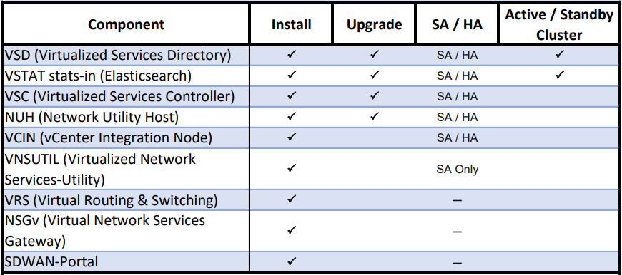
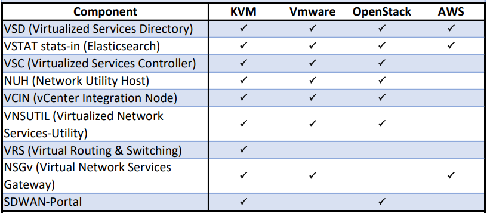

# Nuage Networks Metro Automation Engine (MetroAE)

Version: 5.3.0

MetroAE is an automation engine that can be used to

* Install
* Health check
* Upgrade
* Configure
* Backup/restore
* Shutdown/restart
* Failover/failback

Nuage Networks components. You specify the individual details of your target platform, then let MetroAE do the rest.

## Documentation

The [Documentation](Documentation/) directory contains the following guides to assist you in successfully working with MetroAE. The current documentation covers using MetroAE CLI only.

Note: For users migrating from v4.X to v5, there are some major changes worth looking at. These changes have been summarized [here](Documentation/CHANGES_IN_V5.md). If this is your first time using metroae, you can ignore the document.

File name | Description
--------- | --------
[RELEASE_NOTES](Documentation/RELEASE_NOTES.md) | New features, resolved issues and known limitations and issues
[GETTING_STARTED](Documentation/GETTING_STARTED.md) | MetroAE Quick Start Guide
[SETUP](Documentation/SETUP.md) | Set up your environment by cloning the repo, installing packages and configuring access.
[CUSTOMIZE](Documentation/CUSTOMIZE.md) | Populate variable files for a deployment and unzip Nuage software.
[VAULT_ENCRYPT](Documentation/VAULT_ENCRYPT.md) | Safeguard sensitive data
[DEPLOY](Documentation/DEPLOY.md) | Deploy all VSP components or choose components individually.
[DESTROY](Documentation/DESTROY.md) | Remove existing deployment(s) and start over.
[CONFIG](Documentation/CONFIG.md) | MetroAE Config, the template-driven VSD configuration tool.
[UPGRADE_SA](Documentation/UPGRADE_SA.md) | Upgrade component(s) from one release to the next in a standalone environment.
[UPGRADE_HA](Documentation/UPGRADE_HA.md) | Upgrade component(s) from one release to the next in a clustered environment.
[VSD_SERVICES](Documentation/VSD_SERVICES.md) | Using MetroAE to control VSD Services during maintenance
[VSD_ROLLBACK_RESTORE](Documentation/VSD_ROLLBACK_RESTORE.md)| Roll Back or Restore VSD to original version outside normal upgrade path
[VSD_CLUSTER_FAILOVER](Documentation/VSD_CLUSTER_FAILOVER.md) | Managing VSD cluster failover and failback
[VSD_DISABLED_INTERFACE](Documentation/VSD_DISABLED_INTERFACE.md) | Configure MetroAE to bring up VSD on vCenter with interfaces disabled
[NSGV_BOOTSTRAP](Documentation/NSGV_BOOTSTRAP.md) | Using MetroAE to bootstrap NSGv components
[SD-WAN_PORTAL](Documentation/SD-WAN_PORTAL.md) | Deploying SD-WAN portal using MetroAE
[AWS](Documentation/AWS.md) | Using MetroAE to deploy on Amazon Web Services (AWS)
[TERRAFORM](Documentation/TERRAFORM.md) | Using the Terraform framework in conjunction with MetroAE
[HOOKS_AND_SKIPACTIONS](Documentation/HOOKS_AND_SKIPACTIONS.md) | Configure ability to run custom commands in between playbooks and skip playbooks
[PLUGINS](Documentation/PLUGINS.md) | Add or remove plugins to MetroAE
[AUTOGENERATE_DEPLOYMENTS](Documentation/AUTOGENERATE_DEPLOYMENTS.md) | Generate MetroAE deployment configurations automatically via script
[CONTRIBUTING](CONTRIBUTING.md) | Contribute to MetroAE development
[LICENSE](Documentation/LICENSE.md) | License statement for MetroAE

## Important Notes

You can now run `python run_wizard.py` to let MetroAE help you setup your server and create or edit a deployment. The wizard will ask you questions about what you'd like to do and then create the proper files on disk. run_wizard.py is most useful when you are working with a clone of the nuage-metroae repo. 

MetroAE uses docker containers to hold the required environment. Previous versions of MetroAE used the command `metroae` but the script `metroae-container` is now used. If an older version of the MetroAE container exists, it should be removed from the host by following this procedure:

- Verify if the container is running: `docker ps`. See if metroae is running.
- `metroae container destroy -y`

Please see [RELEASE_NOTES.md](Documentation/RELEASE_NOTES.md) for all the details about what has changed or been added in this release.

All MetroAE operations use a command `metroae-container` for consistent usage and syntax.

MetroAE git clone version now requires Ansible version 3.4.0 or higher. Using the `metroae-container` automatically uses the 3.4.0 ansible version.

## Supported Components for Deployment and Upgrade

MetroAE supports deployment and upgrade of the following components as VMs on the target server. These are the same target server types that are supported on the VSP platform.

### Supported Dataplane components (installed as package/agent):

Component |  KVM  (el6, el7,ubuntu 14.04/16.04) | ESXi
--------- | :----: | -------
VRS (Virtual Routing & Switching) | X | (upgrade only)

### Required Auxiliary Services

* DNS/NTP

## Supported Target Servers

MetroAE supports the deployment and upgrade of Nuage VSP components on the following target servers.

## Typical Nuage Topology

## Main Steps for Using MetroAE

1. [Setup](Documentation/SETUP.md) the MetroAE host. Setup prepares the host for running MetroAE, including retrieving the repository, installing prerequisite packages and setting up SSH access. 

2. Obtain the proper Nuage binary files for your deployment. These can be downloaded from Nuage/Nokia online customer support.

3. [Customize](Documentation/CUSTOMIZE.md) your deployment to match your network topology, and describe your Nuage Networks specifics.

4. [Deploy](Documentation/DEPLOY.md) new components, upgrade a [standalone](Documentation/UPGRADE_SA.md) or [clustered](Documentation/UPGRADE_HA.md) deployment, or run a health check on your system.

5. If things did not work out as expected, [destroy](Documentation/DESTROY.md) your environment and redeploy.

## MetroAE Workflows

MetroAE workflows are the operations that can be performed against a specified deployment.  All supported workflows can be listed via:

    metroae-container --list

Workflows fall into the following categories:

### Standard Workflows

Standard workflows in MetroAE perform the following operations:

Workflow | Operation Description |
------------- | ----------- |
Predeploy | prepares infrastructure with necessary packages and makes the component(s) reachable |
Deploy | installs and configures component(s) |
Postdeploy | performs integration checks, and some basic commissioning tests |
Health | checks health for a running component without assuming it was deployed with MetroAE |
Destroy | removes component(s) from the infrastructure |
Upgrade | upgrades component(s) from one release to another |
Services | controls services for component(s) for maintenance |

The following workflows are examples that combine together several of the above operations into simple to use groups:

* install everything - Deploys all components specified in a deployment.
* destroy everything - Destroys all components specified in a deployment.
* health - Checks the health of all components specified in a deployment.

### Special Workflows

Special workflows in MetroAE perform certain specific operations. Some of them are shown below.

Workflow | Operation Description |
------------- | ----------- |
tools copy qcow | Copy qcow2 images to target server |
tools encrypt credentials | Encrypt credentials.yml in your deployment |
tools unzip images | Unzip Nuage images |
tools convert csv | Convert spreadsheet (CSV) to deployment |
wizard | Run MetroAE Wizard |
vsd certificates renew | Renew certificates on VSDs |
vsc harden | Harden the VSC configuration |

## Collecting Triage Collateral : get_debug.py

In the event that you contact the MetroAE team for help, often via the team's email address, devops@nuagenetworks.net, you might be asked to provide a set of files that provide the collateral our engineers need to triage the situation. `get_debug.py` is provided to make the process of gathering files easier for you. `get_debug.py` will create a zip archive that contains the following files and folders:

* ansible.log
* deployments folder
* src/inventory

If you run `get_debug.py` without arguments, it will include the entire contents of the `deployments` folder, the entire contents of the `src/inventory` folder, and the file `ansible.log`, in a zip file in the current directory. The name of the file, by default, will be of the form `debug-<timestamp>.tar.gz`.

Optionally, you can pass `get_debug.py` 1 or 2 parameters:

* tarFileName: The name of the zip file to create. If not specified, the default value is of the form `debug-<timestamp>.tar.gz`
* deploymentName: The name of the deployment folder under `deployments` to include in the zip file. If not specified, the default action is to include all folders under `deployments`.

Command To run the script:  
python get_debug.py [--tarFileName name-of-file] [--deploymentName name-of-deployment]

## Python-based Ansible Operations Tool

MetroAE is based off of the Python-based Ansible operations tool.

**Ansible** provides a method to easily define one or more actions to be performed on one or more computers. These tasks can target the local system Ansible is running from, as well as other systems that Ansible can reach over the network. The Ansible engine has minimal installation requirements. Python, with a few additional libraries, is all that is needed for the core engine. MetroAE includes a few custom Python modules and scripts. Agent software is not required on the hosts to be managed. Communication with target hosts defaults to SSH. Ansible does not require the use of a persistent state engine. Every Ansible run determines state as it goes, and adjusts as necessary given the action requirements. Running Ansible requires only an inventory of potential targets, state directives, either expressed as an ad hoc action, or a series coded in a YAML file, and the credentials necessary to communicate with the target.

**Playbooks** are the language by which Ansible orchestrates, configures, administers and deploys systems. They are YAML-formatted files that collect one or more plays. Plays are one or more tasks linked to the hosts that they are to be executed on.

**Roles** build on the idea of include files and combine them to form clean, reusable abstractions. Roles are ways of automatically loading certain vars files, tasks, and handlers based on a known file structure.

## Nomenclature

**Ansible Host**: The host where MetroAE runs. Ansible and the required packages are installed on this host. The Ansible Host must run el7 Linux host, e.g. CentOS 7.* or RHEL 7.*.

**MetroAE User**: The user who runs MetroAE to deploy and upgrade components.

**Target Server**: The hypervisor on which one or more VSP components are installed as VMs. Each deployment may contain more than one Target Server.

## Questions, Feedback, and Contributing

Ask questions and get support on the [MetroAE site](https://devops.nuagenetworks.net/).
You may also contact us directly.
  Outside Nokia: [devops@nuagenetworks.net](mailto:devops@nuagenetworks.net "send email to nuage-metro project")
  Internal Nokia: [nuage-metro-interest@list.nokia.com](mailto:nuage-metro-interest@list.nokia.com "send email to nuage-metro project")

Report bugs you find and suggest new features and enhancements via the [GitHub Issues](https://github.com/nuagenetworks/nuage-metroae/issues "nuage-metroae issues") feature.

You may also [contribute](CONTRIBUTING.md) to MetroAE by submitting your own code to the project.

## License

[LICENSE](Documentation/LICENSE.md)
